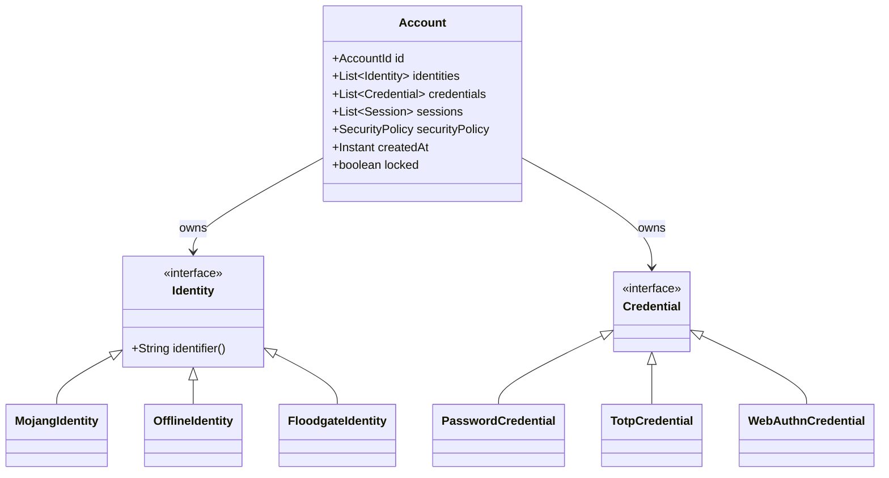

# GatotAuth

GatotAuth is a modular, highly extensible authentication and identity management platform designed for the Minecraft ecosystem. It provides a platform-independent API and core implementation, separating core authentication logic from specific Minecraft proxy or server platform adapters.

## Why GatotAuth Exists

Traditionally, Minecraft authentication plugins are tightly coupled to specific platform APIs (such as Spigot, Paper, or Velocity) and rely on monolithic database schemas. This design hampers extensibility and makes it difficult to add modern authentication methods (like WebAuthn, OAuth, or Discord integration) or share sessions across proxy networks.

GatotAuth resolves this by utilizing a decoupled hexagonal architecture:
- Core engines (Authentication, Sessions, Security) are completely platform-independent.
- Platform adapters (such as Velocity) serve purely to translate platform events into core operations.
- The storage system is structured around an SPI, permitting easy swaps of database drivers (e.g. SQLite, PostgreSQL).

## Architecture Overview

GatotAuth uses a polymorphic identity and credential domain model. Instead of storing username and password directly on a single record, GatotAuth models them as a root `Account` owning lists of decoupled `Identity` and `Credential` records.



## Module Layout

- `gatotauth-api`: Core domain records, events, service interfaces, and SPIs. Contains no runtime logic.
- `gatotauth-core`: Thread-safe service implementations, pipeline routines, configuration systems, and SQL storage providers.
- `gatotauth-platforms/velocity`: Velocity platform adapter translating proxy events to core engines.
- `gatotauth-loaders/velocity-loader`: Platform plugin bootstrap loader.

## Building

GatotAuth requires Java 21 and Gradle to compile:

```bash
git clone https://github.com/gatotauth/gatotauth.git
cd gatotauth
./gradlew build
```

The compiled binaries will be output to their respective build directories (e.g., `gatotauth-platforms/velocity/build/libs/`).

## Installation

To install GatotAuth on a Velocity proxy:

1. Copy the compiled `gatotauth-platforms/velocity-1.0.0-SNAPSHOT.jar` to the proxy's `plugins/` directory.
2. Start the proxy server to generate the default configuration.
3. Configure `config.json` inside the generated `plugins/gatotauth/` directory.
4. Restart the proxy.

## Configuration

The default configuration file is `config.json`:

```json
{
  "storage.type": "sqlite",
  "storage.sqlite.path": "gatotauth.db",
  "security.password.strength": 10,
  "session.expiration-minutes": 30
}
```

## Developer API

Other plugins can interact with GatotAuth services by accessing the service registry:

```java
import dev.gatotauth.api.GatotAuthApi;
import dev.gatotauth.api.service.AccountManager;

AccountManager accountManager = GatotAuthApi.getProvider().getRegistry().get(AccountManager.class);
if (accountManager != null) {
    accountManager.findByUsername("PlayerName")
            .thenAccept(optAccount -> {
                // Handle account
            });
}
```

## License

GatotAuth is licensed under the MIT License. See the [LICENSE](LICENSE) file for details.
