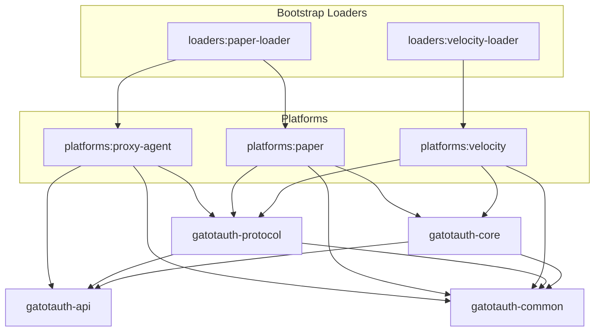

# GatotAuth Dependency Graph & Architectural Review

This document contains a complete architectural review of GatotAuth, analyzing dependencies, boundaries, package layouts, and long-term scalability.

---

## 1. Module Dependency Graph



### Allowed Dependencies
- `gatotauth-api` must have **zero** internal dependencies (clean interface definition).
- `gatotauth-common` must have **zero** subproject dependencies.
- `gatotauth-core` depends only on `api` and `common` to implement domain use cases.
- `gatotauth-protocol` depends on `api` and `common` to bind packet-level constraints to login state.
- `platforms:proxy-agent` is strictly forbidden from depending on `core`. It must remain a lightweight client.

### Forbidden Dependencies
- `core` or `api` depending on any module inside `platforms` or `loaders` (violates Clean Architecture).
- `api` depending on `core` (violates API-First separation).
- `proxy-agent` depending on `core` (guarantees proxy-agent remains database-free).

---

## 2. Bounded Contexts

| Bounded Context | Responsibility | Owning Module |
| :--- | :--- | :--- |
| **Identity & Account** | Managing user registrations, credentials, and state transitions (e.g., locked status). | `gatotauth-api` (interfaces), `gatotauth-core` (use cases) |
| **Authentication** | Running the login/registration state machine and validation pipeline. | `gatotauth-core` |
| **Sessions** | Managing token validation, TTL, and cross-proxy replication (Redis). | `gatotauth-core` |
| **Security** | Brute-force protection, rate-limiting, and Argon2id hashing algorithms. | `gatotauth-core` |
| **Storage & I/O** | Handling SQL connection pooling, Redis lookups, and schema migration runs. | `gatotauth-core` |
| **Protocol & Packets** | Intercepting Netty streams, cancelling/blocking unauthorized player packets. | `gatotauth-protocol` |
| **Platform Integration** | Handling server events, command registration, and kicking unauthorized players. | `gatotauth-platforms:*` |
| **Extensions (SDK)** | SPI loader engine and lifecycle interfaces for third-party extensions. | `gatotauth-api` & `gatotauth-core` |

---

## 3. Dependency Rules

1. **Platform Independence**: Neither `api`, `core`, `common`, nor `protocol` may import packages from `com.velocitypowered.*`, `org.bukkit.*`, or `io.papermc.*`.
2. **Implementation Hiding**: Developer-facing API (`api`) must not export or leak classes from `core` (e.g. HikariDataSource, RedissonClient, Argon2).
3. **No Direct Thread Blocking**: Platform adapters must dispatch all asynchronous execution onto core scheduler executors and never block Netty event loops or Minecraft main tick threads.
4. **Decoupled Messaging**: The `proxy-agent` must communicate with the proxy exclusively using plugin messaging channels (`velocity:main` -> `gatotauth:auth-state`).

---

## 4. Package Ownership

```
dev.gatotauth
├── api
│   ├── domain
│   │   ├── user          (User, Account, Username)
│   │   └── session       (Session, SessionId)
│   ├── event             (Domain Events)
│   └── provider          (PasswordHasher, NotificationProvider interfaces)
├── core
│   ├── auth              (LoginPipeline, Authentication engines)
│   ├── security          (RateLimiter, Argon2id, BruteForceTracker)
│   ├── storage           (Database connections, SQL migration runners, repositories)
│   └── extension         (SDK bootloader, context builders)
├── common
│   ├── config            (Settings parsers)
│   └── text              (MiniMessage templates and localization)
└── protocol
    └── packet            (PacketEvents adapters, packet cancellation logic)
```

---

## 5. Future Scalability (100k+ LOC Analysis)

As GatotAuth grows to 100k+ lines, the following architectural challenges will arise:

### 1. Gradle Configuration Overhead
- *Issue*: Applying `subprojects {}` configurations in the root build file scales poorly, slowing down build configuration times.
- *Recommendation*: Move shared configuration rules into Gradle Convention Plugins (`buildSrc` or composite builds) once the codebase exceeds 20,000 lines.

### 2. Service Provider Interface (SPI) Leakage
- *Issue*: Loading third-party extensions dynamically can result in ClassLoader memory leaks when plugins are reloaded.
- *Recommendation*: Introduce a strict extension sandbox wrapping each jar in an isolated classloader that nullifies static references on shutdown.

### 3. Database Schema Evolution
- *Issue*: Multi-database support (SQLite, PostgreSQL, MySQL) becomes hard to manage using plain SQL migrations at scale.
- *Recommendation*: Implement database-specific SQL dialect generators within the custom migration subsystem.

---

## 6. Final Architecture Review

### Velocity Maintainer
> Velocity is asynchronous by nature. The `velocity-loader` bootstrap must register listeners early in the handshake lifecycle. The separation of `proxy-agent` is excellent, ensuring backend servers do not run double database pools.

### Paper & Folia Maintainer
> Folia is highly region-sensitive. The Paper platform adapter must schedule player actions (teleportation, restriction removal) within the region scheduler using the player's current location. By keeping `core` thread-agnostic and returning `CompletableFuture`, GatotAuth integrates smoothly with Folia.

### LuckPerms Maintainer
> The loader modules are the correct decision. Relocating library packages to `dev.gatotauth.lib.*` prevents classpath clashes. Ensure that ServiceLoader registration paths are updated to match the relocated JDBC and Jedis drivers.

### ViaVersion Maintainer
> Consolidating PacketEvents into `gatotauth-protocol` prevents packet translation fragmentation. Ensure the loader loads PacketEvents in an isolated loader scope to prevent version conflicts with servers running standalone PacketEvents plugins.

### Senior Java Architect
> The architecture matches clean architecture rules. The separation between the API, core engine, and platform runtime adapters is sound. Moving from configuration injection to isolated loader bootstrapper ensures long-term operational stability.
