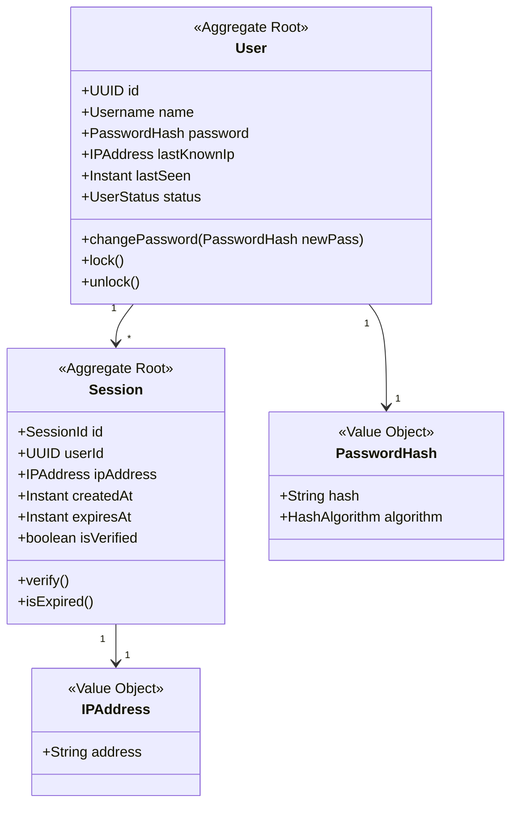

# GatotAuth Domain Model

This document outlines the Domain-Driven Design (DDD) domain entities, aggregates, value objects, and events.

## 1. Domain Entities & Aggregates

### User (Aggregate Root)
Represents a Minecraft player registered on the network.
- **Invariants**:
  - A user must have a unique UUID.
  - A username must be between 3 and 16 characters (alphanumeric + underscore).
  - A user status must be transitionable (e.g., `UNREGISTERED -> REGISTERED -> LOCKED`).

### Session (Aggregate Root)
Represents an active authenticated session.
- **Invariants**:
  - A session is bound to a single User UUID and IP address.
  - A session has a strict expiration date.
  - Once expired, a session cannot be re-validated (immutable state transition).

## 2. Value Objects (Immutable)
- `PasswordHash`: Holds the cryptographically safe hash representation (hash, salt parameters, algorithm type).
- `IPAddress`: IPv4/IPv6 address representation with helper functions for subnets.
- `Username`: Cleaned and validated username string.

## 3. Domain Events
- `UserRegistered`: Fired when a new user registers.
- `UserAuthenticated`: Fired upon successful authentication.
- `SessionExpired`: Fired when a user session reaches its TTL.
- `BruteForceAttemptDetected`: Fired when a threshold of failed attempts is reached for an IP or UUID.

## 4. Alternative Designs & Trade-offs
- *Alternative*: Represent everything as simple mutable Pojos.
- *Trade-off*: Invites synchronization bugs across threads. Using immutable Value Objects and strict entity transitions prevents thread-safety issues during login processing.
