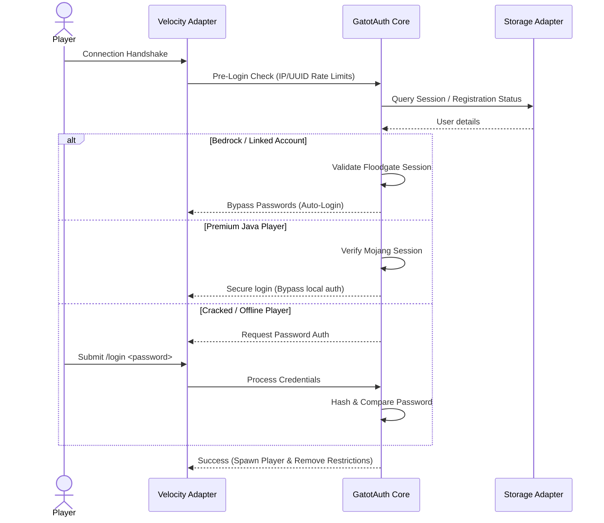

# Login Pipeline Design

The GatotAuth login pipeline manages a player's lifecycle from connection handshake to successful authentication.

## 1. Pipeline Stages



## 2. Pipeline Design Pattern
We recommend a **Pipeline Pattern** (Chain of Responsibility) using non-blocking asynchronous interceptors:

```java
public interface LoginInterceptor {
    CompletableFuture<InterceptorResult> intercept(LoginContext context);
}
```

### Pipeline Steps:
1. **RateLimiterInterceptor**: Assesses IP connection count. Kicks if limits are exceeded.
2. **GeoIP/WhitelistingInterceptor**: Validates country or range limits.
3. **SessionAutoLoginInterceptor**: Verifies if IP and UUID match an existing active session.
4. **LinkAuthenticationInterceptor**: Intercepts Geyser/Floodgate Bedrock UUIDs to skip authentication.
5. **CredentialRequestInterceptor**: Serves the command instruction context if offline authentication is required.

## 3. Alternatives & Trade-offs
- *Alternative: Direct Event Handler*: Handle everything in a monolithic event listener class.
- *Trade-off*: Monolithic listeners lead to spaghetti code with deep nesting (`if/else`). The interceptor chain is highly modular: writing a new integration (e.g., discord linking) only requires adding a single clean interceptor.
